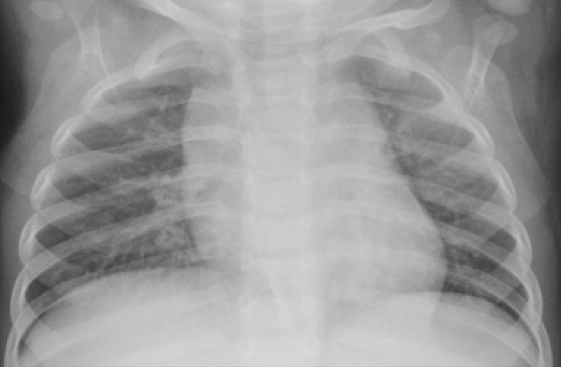

# Chest-X-Ray-Image_Classification

## Introduction 

This project investigated the use of Deep Learning for classifying chest X-rays into normal and pneumonia cases. We established Convolutional Neural Network (CNN) as the baseline model.

## Business Case

The project aims to detect pneumonia cases quicker. This can be acheived by differentiating healthy lungs from from those infected.
The dataset used is from [Kaggle](https://www.kaggle.com/paultimothymooney/chest-xray-pneumonia)

## Exploratory Data Analysis

- The training images were 1342 for the Normal (healthy) cases and 3876 for Pneumonia cases
- The test images were 234 for the Normal cases and 390 for Pneumonia cases
- Validation Images were 9 for the Normal cases and Pneumonia cases

We also checked for the average image size of the training, testing and validation images. This necessitated the:
    - Resizing
    - Normalizaition
    - Augmentation

## Modeling

We conducted an extensive model comparison, evaluating various architectures including a baseline CNN MODEL, a tuned CNN with hyperparameter optimization, a modified CNN architecture, and a pre-trained ResNet50v2 model. The baseline CNN model served as a foundational architecture, then tuned CNN with hyperparameter optimization and a modified CNN architecture. Lastly, a pretrained ResNet50V2 model, known for its depth and performance. Leveraging insights from exploratory data analysis (EDA), we optimized these models for image size, class distribution, and regularization techniques to mitigate overfitting. Through rigorous experimentation and evaluation, we sought to identify the most effective model configurations, utilizing metrics such as accuracy and loss to guide refinement and ensure robust, high-performing classifiers capable of accurately discerning normal from pneumonia cases in X-ray images.

#### CNN Model Performance
- Validation Loss: 256.3694152832031
-Validation Accuracy: 0.5
-Test Loss: 172.31935119628906
-Test Accuracy: 0.375

Validation accuracy of 0.5 wasn't ideal but could be improved by training more on the dataset. In our case we utilized a different cnn architecture.

#### Tuned Baseline Model (CNN)
- Validation Loss: 25.11384391784668
- Validation Accuracy: 0.5625
- Test Loss: 40.0745735168457
- Test Accuracy: 0.4166666567325592

#### Different Architecture Model
- Validation Loss: 30.517587661743164
- Validation Accuracy: 0.5
- Test Loss: 19.448657989501953
- Test Accuracy: 0.625

#### ResNet50V2
The performance is as follows:

-Validation Loss: 0.2682477533817291
-Validation Accuracy: 0.875
-Test Loss: 0.23323379456996918
-Test Accuracy: 0.9150640964508057

The validation accuracy of 0.87 performed better and ResNet50V2 proved to be better for identify pneumonia.

#### Model Comparison

| Sn. No. | Model Name                | Model Architecture             | Hyperparameters                                | Training Time | Validation Accuracy | Test Accuracy | Test Loss |
|---------|---------------------------|--------------------------------|-----------------------------------------------|---------------|---------------------|---------------|-----------|
| 1       | Baseline Model            | CNN with original architecture | Adam optimizer, learning rate=0.001           | 48.40 mins        | 0.50                | 0.38          | 172.32      |
| 2       | Tuned Baseline Model      | CNN with original architecture | Adam optimizer, learning rate=0.001, early stopping | 26.45 mins        | 0.56                | 0.42          | 40.07      |
| 3       | Different Architecture Model | CNN with modified architecture | Adam optimizer, learning rate=0.001, early stopping           | 10.25 mins       | 0.45                | 0.63         | 19.45      |
| 4       | ResNet50v2 Model          | Pretrained ResNet50v2          | Adam optimizer, learning rate=0.0001          | 48 mins       | 0.88                | 0.92          | 0.23      |

## Conclusion

ResNet50v2 performed best in terms of accuracy. This pre-trained model offers a significant advantage; it can accelerate the development of reliable diagnostic tools. However, there's a trade-off to consider. ResNet50v2 requires more training time compared to other models. Therefore, the ideal choice depends on the specific situation. If getting the most accurate results is paramount, ResNet50v2 stands out as a powerful option. But if speed is a critical factor, another model might be a better fit.

## Recommendations

While the results from the models are positive, there can be further improvements to get the 
most accurate diagnoses using deep learning.
###### Accuracy: 
Optimization algorithms can be employed to refine the existing deep learning models
###### Deployment:
Focus on creating a system that functions effectively with limited computational resources.
###### Validation:
Validating the developed model through clinical trials is needed to ensure its reliability for diagnoses.

## References
- Kermany, Daniel; Zhang, Kang; Goldbaum, Michael (2018), “Large Dataset of Labeled Optical Coherence Tomography (OCT) and Chest X-Ray Images”, Mendeley Data, V3, doi: 10.17632/rscbjbr9sj.3
- Salehi M, Mohammadi R, Ghaffari H, Sadighi N, Reiazi R. Automated detection of pneumonia cases using deep transfer learning with paediatric chest X-ray images. Br J Radiol. 2021 May 1;94(1121):20201263. doi: 10.1259/bjr.20201263. Epub 2021 Apr 16. PMID: 33861150; PMCID: PMC8506182.

## Contributors
- Joyleen Cherono
- Allan Eshitera
- Johnmark Kibui
- Andrew Maina
- Colins Wanjao